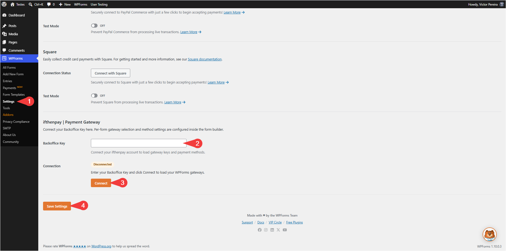
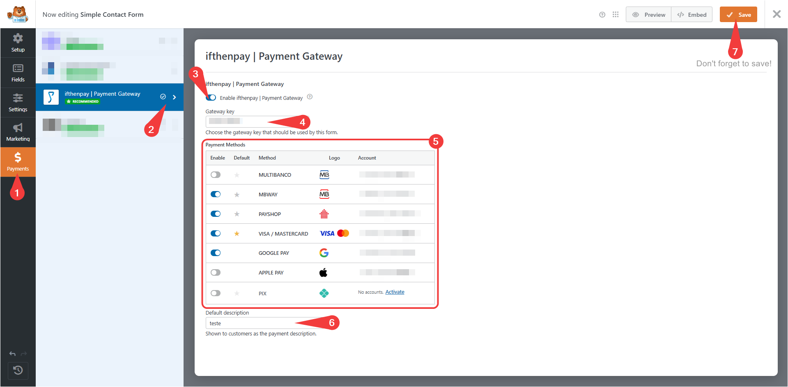
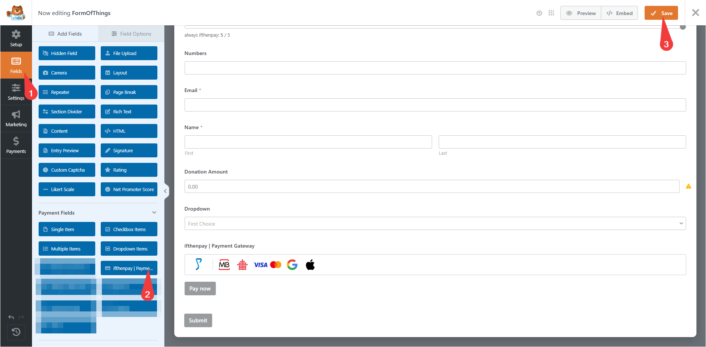
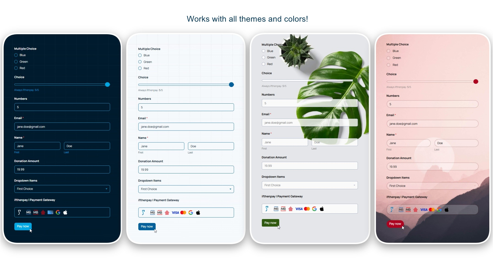
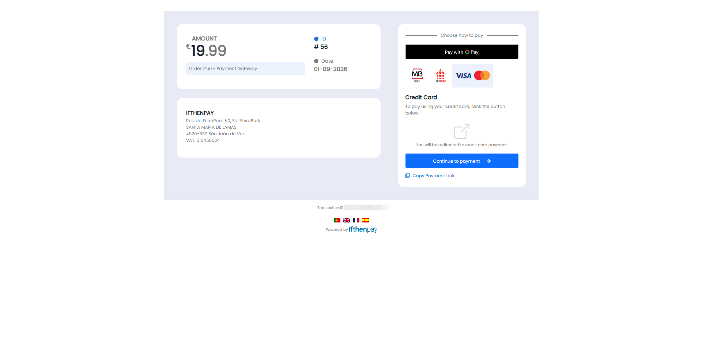
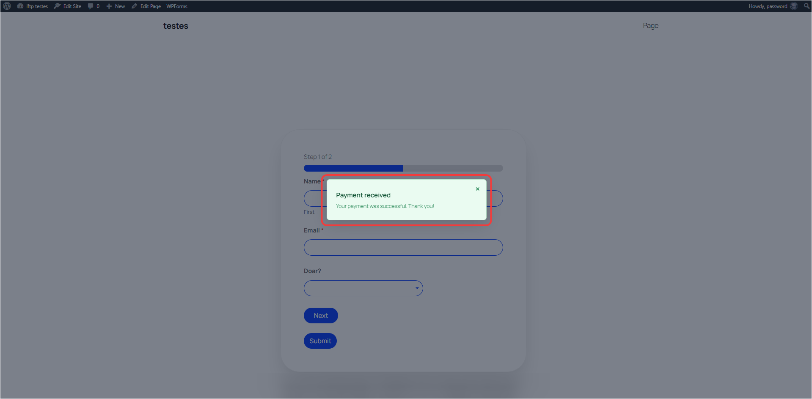
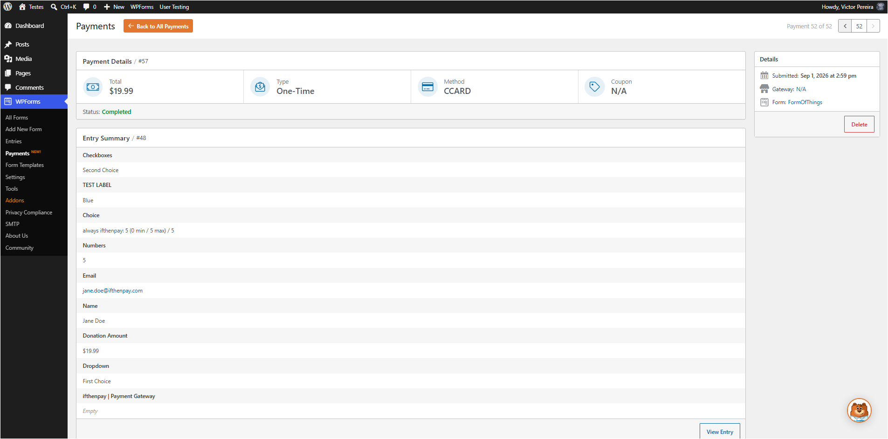
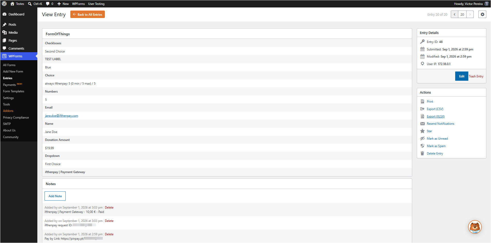

# ifthenpay | Pagos para WPForms

[English](README.md) | [Português](README.pt.md) | **Español** | [Français](README.fr.md)

Añade métodos de pago de ifthenpay a WPForms: tarjetas, carteras digitales y métodos de pago locales; admite pagos únicos y seguros mediante pay-by-link.

---

## Índice

- [Descripción](#descripción)
- [Características Principales](#características-principales)
- [Requisitos](#requisitos)
- [Instalación](#instalación)
- [Configuración del Formulario](#configuración-del-formulario)
- [Usar ifthenpay Junto con Otra Pasarela de Pago](#usar-ifthenpay-junto-con-otra-pasarela-de-pago)
- [Preguntas Frecuentes](#preguntas-frecuentes)
- [Servicios Externos](#servicios-externos)
- [Capturas de Pantalla](#capturas-de-pantalla)
- [Soporte](#soporte)

## Descripción

Este plugin integra la pasarela de pago ifthenpay con WPForms para permitir la recogida de pagos directamente desde sus formularios. Los pagos se procesan mediante un sistema seguro de pay-by-link, garantizando que no se almacenen datos sensibles de tarjetas o datos bancarios en su sitio web. Los clientes pueden completar el pago con el método que prefieran a través de una página de pago segura. Tras enviar un formulario, los usuarios son redirigidos a la página de pago segura alojada por ifthenpay para completar la transacción; a continuación, ifthenpay envía una notificación (callback) del lado del servidor para actualizar automáticamente el estado del pago.

### En términos sencillos, obtiene:

- Pagos únicos directamente desde WPForms
- Soporte para cupones y cálculo automático de totales
- Backoffice del comerciante (ventas básicas) en web y móvil
- Confirmaciones de pago automáticas y seguras (sin almacenar números de tarjeta)

Todas las configuraciones se realizan en WPForms y en su Backoffice de ifthenpay. El plugin está diseñado para que los propietarios de sitios puedan gestionar pagos sin necesitar conocimientos técnicos avanzados.

## Características Principales

1. Integración completa con el flujo de pago de WPForms Lite y Pro
2. Transacciones seguras
3. Confirmación automática de pago
4. Soporte para múltiples métodos de pago (tarjetas, carteras digitales, transferencias)
5. Soporte de cupones y descuentos a través de WPForms
6. Redirección segura a página completa hacia la página de pago alojada por ifthenpay
7. Estado del pago en tiempo real en las entradas de WPForms
8. Soporte multiidioma (EN, ES, FR, PT)
9. Seguridad ante todo (no se almacenan datos de tarjetas)

## Requisitos

- Una cuenta de comerciante ifthenpay activa — [suscríbase aquí](https://ifthenpay.com/aderir/) para obtener sus credenciales.
- Una Clave de Pasarela de WPForms (solicítela al soporte/helpdesk de ifthenpay).
- Los métodos de pago que desea activar en esa Clave de Pasarela (nuestro equipo de helpdesk le guiará).
- WordPress 6.5+ y PHP 8.2+, con WPForms instalado y activado.
- HTTPS (SSL) habilitado en su sitio.

## Instalación

1. **Instalar:** Cargue el archivo zip del plugin en `Plugins → Añadir nuevo → Subir`, o instálelo desde WordPress.org, y actívelo.
2. **Credenciales:** Asegúrese de que su cuenta ifthenpay tiene una Clave de Pasarela de WPForms activa con los métodos de pago deseados habilitados.
3. **Configuración:** Vaya a `WPForms → Ajustes → Pagos` e introduzca su Backoffice Key.
4. **Configuración del formulario:** `Crear/Editar un formulario → pestaña Pagos → Añadir el campo Ifthenpay al formulario → activar "ifthenpay | Payment Gateway"` y seleccione una Clave de Pasarela. A continuación, elija qué métodos de pago activar de entre los disponibles en su pasarela y defina su método de pago predeterminado. Por último, añada una descripción de pago, que se mostrará en la página de pago de ifthenpay en todas las transacciones.

## Usar ifthenpay Junto con Otra Pasarela de Pago

WPForms solo permite un método de pago activo por envío. Si un formulario tiene visibles al mismo tiempo tanto el campo de ifthenpay como el campo de otra pasarela de pago (PayPal, Stripe, Square o Authorize.Net), el campo de ifthenpay se oculta automáticamente —logotipo, métodos de pago y botón "Pagar ahora"— de modo que los clientes solo vean la opción de pago que realmente funcionará, en lugar de un botón que fallaría o cobraría dos veces.

- El campo de ifthenpay vuelve a aparecer automáticamente si el campo de la otra pasarela se oculta de nuevo (por ejemplo, mediante la lógica condicional de WPForms), sin necesidad de recargar la página.
- Esto solo se aplica a los campos de pasarela que estén realmente visibles en el formulario. Un campo de pasarela presente pero oculto por lógica condicional no activa este comportamiento.
- Los campos nativos de WPForms como Total, Cupón y los elementos de pago de selección única/múltiple/casilla/lista nunca se tratan como pasarelas competidoras; solo lo son los campos de PayPal, Stripe, Square y Authorize.Net.

## Preguntas Frecuentes

<strong>¿Este plugin requiere WPForms?</strong>

Sí. WPForms debe estar instalado y activo para utilizar este plugin.

<strong>¿Admite pagos recurrentes?</strong>

No. Esta versión solo admite pagos únicos mediante pay-by-link.

<strong>¿Se almacenan los datos de pago?</strong>

No. El plugin no almacena números de tarjeta ni datos bancarios completos. Solo se guardan las referencias mínimas necesarias para conciliar el pago.

<strong>¿Admite cupones de WPForms?</strong>

Sí. Los campos de cupón de WPForms son totalmente compatibles y los descuentos se calculan automáticamente.

<strong>¿Qué métodos de pago se admiten?</strong>

Cualquier método de ifthenpay asociado a su Clave de Pasarela (por ejemplo, Multibanco, MB WAY, Payshop, Tarjeta de Crédito, Google Pay, Apple Pay, Pix).

<strong>¿Cómo funciona el proceso de pago?</strong>

Tras el envío del formulario, los usuarios son redirigidos a una página de pago segura alojada por ifthenpay. Una vez completado el pago, el estado se actualiza automáticamente mediante un callback.

<strong>¿Qué ocurre si un pago falla?</strong>

La entrada se marca como Fallida. Los usuarios pueden reintentar el pago según su configuración.

<strong>¿Puedo personalizar la experiencia de pago?</strong>

Sí. Puede configurar el texto del botón, la descripción y el estilo dentro de WPForms.

<strong>¿Qué ocurre si mi formulario también tiene otro campo de pasarela de pago (PayPal, Stripe, Square, Authorize.Net)?</strong>

El campo de ifthenpay se oculta automáticamente mientras el campo de la otra pasarela esté visible, de modo que los clientes nunca vean dos opciones de pago activas a la vez. Consulte <a href="#usar-ifthenpay-junto-con-otra-pasarela-de-pago">Usar ifthenpay Junto con Otra Pasarela de Pago</a>.

<strong>¿Existe un entorno de pruebas (sandbox)?</strong>

ifthenpay puede proporcionar entidades de prueba; si no están disponibles, utilice una prueba real de bajo valor.

<strong>¿Qué tan segura es la integración?</strong>

Las solicitudes se cifran mediante HTTPS; no se almacenan datos de pago sensibles.

<strong>¿El complemento de ifthenpay para WPForms admite WEBHOOKS (Callbacks)?</strong>

¡Sí! El complemento de ifthenpay para WPForms a partir de la versión 2.0.0 y las siguientes admite webhooks (callbacks).

## Servicios Externos

Este plugin se integra con la plataforma de pagos de ifthenpay para procesar los pagos de los envíos de WPForms. ifthenpay es un servicio de terceros que ofrece procesamiento seguro de pagos con tarjeta, carteras digitales y transferencias bancarias locales.

- **WPForms**
  - **Qué es y para qué se utiliza**: Un plugin de creación de formularios utilizado para crear formularios de pago. Este plugin amplía sus capacidades de pago.

- **Backoffice e Integraciones de ifthenpay**
  - **Qué es y para qué se utiliza**: El Backoffice de ifthenpay es el panel del comerciante utilizado para gestionar integraciones y configuraciones de pago. El plugin utiliza la API de ifthenpay para generar enlaces de pago y validar transacciones.
  - **Qué datos se envían y cuándo**:
    - Durante la configuración: Backoffice Key y Gateway Key para autenticación y obtención de la configuración.
    - Durante el procesamiento del pago: ID de referencia del pedido, importe, descripción, cuentas de métodos de pago habilitados, URLs de retorno de éxito/error/cancelación, idioma y, opcionalmente, el método de pago seleccionado, el correo electrónico del cliente, el nombre del cliente y los datos de los campos del formulario.
    - Durante el registro del webhook: la Gateway Key y la URL de callback de este sitio, para que ifthenpay pueda notificar directamente al sitio cuando se resuelva un pago.
    - Durante las solicitudes de activación de método de pago: cuando un administrador solicita la activación de un nuevo método de pago desde `WPForms → Ajustes → Pagos`, se envía un correo electrónico al soporte de ifthenpay (suporte@ifthenpay.com) que contiene la Backoffice Key, la Gateway Key, el método de pago solicitado, la dirección de correo del administrador, la URL del sitio, el nombre del sitio, la versión de WordPress, la versión de WPForms y la versión del plugin.
    - Durante los callbacks: Estado del pago y método de pago.
  - **Acuerdo de Licencia de Usuario Final (EULA)**: [EULA](https://ifthenpay.com/eula/)
  - **Política de Privacidad**: [Política de Privacidad](https://ifthenpay.com/politica-de-privacidade/)

Todas las solicitudes de red se realizan del lado del servidor mediante HTTPS. Las credenciales sensibles se almacenan de forma segura y no se exponen públicamente. No se almacenan datos en bruto de tarjetas ni bancarios.

## Capturas de Pantalla

A continuación se muestran capturas de pantalla que demuestran las características e interfaces clave del plugin:

1. **(Solo Admin) Sincronización del Backoffice en WPForms Settings Payments**
   
2. **(Solo Admin) Página de administración de WPForms (Creación/Edición de Formulario -> Pagos)**
   
3. **(Solo Admin) Añadir el campo de Pago de ifthenpay al formulario seleccionado**
   
4. **(Experiencia del Cliente) La visualización del campo de Pasarela de Pago varía según los ajustes de WPForms**
   
5. **(Experiencia del Cliente) Página de Pago Segura de ifthenpay**
   
6. **(Experiencia del Cliente) Mensaje de Pago (pagado, pendiente, cancelado o fallido)**
   
7. **(Solo Admin) Detalles del Pago**
   
8. **(Solo Admin) Entradas de Pago**
   

## Soporte

Para asistencia, utilice el [foro de soporte de WordPress.org](https://wordpress.org/support):

Comprobaciones previas:

- Método de pago habilitado en la Clave de Pasarela Y asignado a la Integración
- Ejecutar las versiones actuales recomendadas de WordPress, PHP y WPForms

Helpdesk comercial disponible (sin necesidad de correo directo): [helpdesk.ifthenpay.com](https://helpdesk.ifthenpay.com/)

- **Soporte de ifthenpay**: [suporte@ifthenpay.com](mailto:suporte@ifthenpay.com)
- **Documentación de WPForms**: [WPForms docs](https://wpforms.com/docs/)
